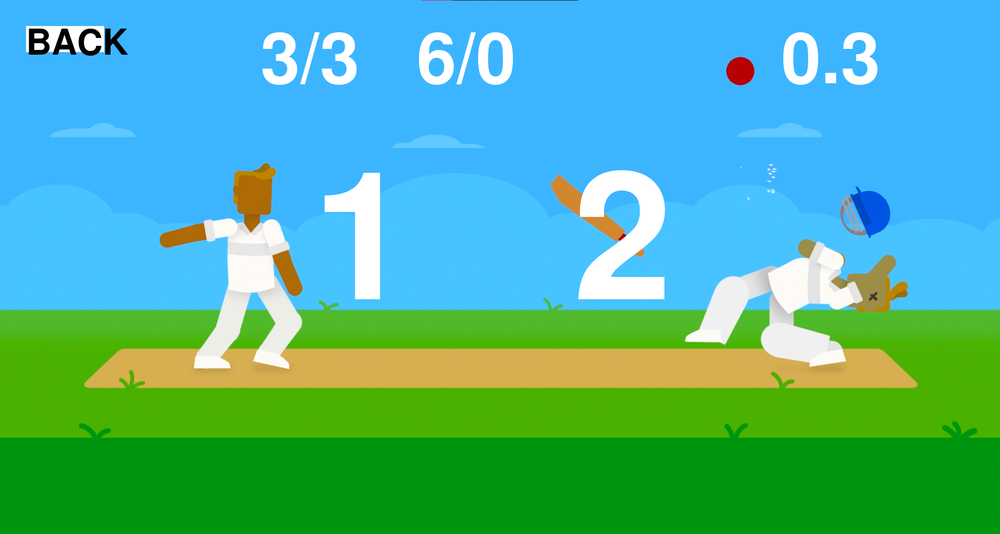

Remember when we used to play little dumb games in reccess and under the desk hiding from our SST teacher. :smile: :sweat_smile: 
It was not the game itself which required sophisticated strategy but the simplicity and ability which made it fun playing it with friends. :stuck_out_tongue_winking_eye:
We wanted to create a virtual version with the same level of engagement as the original one. :relieved: :relaxed:
Since we are sitting in front of our keyboards this physically interactive game seemed like a welcome respite! :see_no_evil: :see_no_evil: :see_no_evil:

# Gamedev-Hackathon

Dependencies for AI-try.py: mediapipe (can be installed with pip/pip3 install mediapipe) and opencv.Finger Cricket where finger gestures are recognized by camera and given as input to the program.

# Screenshots :raised_hands:

